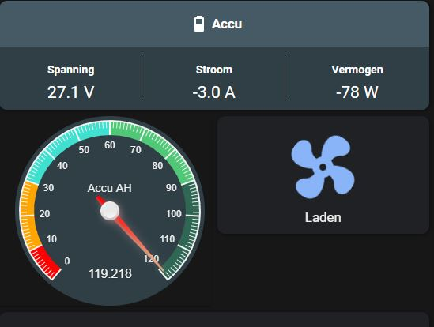
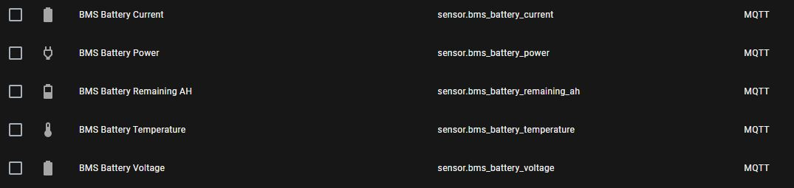

# ANT BMS to MQTT broker

This repo is a set of files, to connect a ANT-BMS over bluetooth to a raspberry pi. The raspberry pi then sends the collected data to a MQTT broker, for display in Home automation systems like Home assistant.



## Setup
To setup the system, you need a [ANT-BMS](https://www.aliexpress.com/item/32997552090.html?spm=a2g0s.9042311.0.0.27424c4dvSMF6Q), a Raspberry Pi with bluetooth support, and some system that is running a MQTT broker like home assistant.

### Pairing the BMS with the Raspberry Pi
Open a ssh connection to your Raspberry Pi
```
bluetoothctl
[] power on
[] scan on
```
At this point to BMS should show in the the list. MAC of the BMS is AA:BB:CC:A1:23:45. There is another device with a slightly different MAC, do not use that one, as it is the Low Energy version.

```
[] pair AA:BB:CC:A1:23:45
```
and enter the password, in my case 1234
```
[] trust AA:BB:CC:A1:23:45
[] quit
```

### Setting up a serial port, to communicate with the BMS
Comminication is over a Bluetooth to Serial connection, so we need to setup a serial port on the raspberry pi.

To test, enter this commands:
```
 bind /dev/rfcomm2 AA:BB:CC:A1:23:45
 ls -al /dev/rf*
```
result should be like this:
```
crw-rw---- 1 root dialout 216,   1 Jul  1 18:33 /dev/rfcomm1
crw-rw---- 1 root dialout 216,   2 Jul  8 13:03 /dev/rfcomm2
crw-rw-r-- 1 root netdev   10, 242 Jul  1 18:33 /dev/rfkill
```
In my case, I have two bluetooth connections, /dev/rfcomm2 is the connection to the ANT-BMS. The ```rfcomm.sh``` can be edited, to have the correct port.

To make the port apear on startup, do the following:
```
cp -av rfcomm.sh /opt
chmod +x /opt/rfcomm.sh
cp -av rfcomm.service /etc/system.d/system
systemctl enable rfcomm.service
reboot
```
After the reboot, /dev/rfcomm2 should be present.


### Seting up the BMS to MQTT Broker
Before starting the broker, the credentials must be set.
```
cp -av antbms.py /opt
cd /opt
python3 antbms.py --help
nano antbms.py (edit line 35 to edit the mqtt credentials)
python3 antbms.py -v
```
I plan to fix the setting of the mqtt credentials in a near future.
The BMS to MQTT broker also can be setup as a service to run on boot of the Raspberry Pi
```
cp -av bms.service /etc/system.d/system
systemctl enable bms.service
reboot
systemctl status bms.service
```
For debugging, stop the service and run ```python3 antbms.py -v``` from the ```/opt``` folder. A log file will be in /var/log/bms.log

### Setting up home assistant
Go to the Superviser menu, and make sure Mosquitto is setup. The ANT-BMS uses the default setup of Mosquitto. Next go to ```Configuration->Entities```
The items from the broker shoud be visible in the list :

Next, you can setup some UI in the dashboard. Mine looks like this:
```
- type: custom:banner-card
  heading:
  - mdi:battery-50
  - Accu
  background: '#455A64'
  style: |
    ha-card .heading { 
      font-size: 1.2em;
      font-weight: bolder;
    }
  entities:
  - entity: sensor.bms_battery_voltage
    name: Spanning
  - entity: sensor.bms_battery_current
    name: Stroom
  - entity: sensor.bms_battery_power
    name: Vermogen
```


